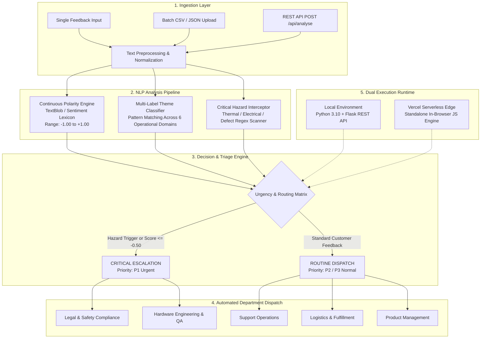

# MoodMeter: Brand Sentiment Intelligence and Automated Triage Platform

A high-accuracy, explainable Natural Language Processing (NLP) system and interactive web console for ingesting customer reviews, scoring sentiment polarity, detecting operational themes, and flagging critical safety hazards for automated team routing.

Built to run **100% self-contained** with **zero server dependencies on Vercel** and **zero paid subscriptions**.

---

## Key Features

- **Continuous Polarity Scoring**: Evaluates customer text on a continuous scale from `-1.00` (maximally negative) to `+1.00` (maximally positive) with negation and intensifier handling.
- **Automated Topic Categorisation**: Flags department themes across 6 operational areas: *Product Quality*, *App & Software*, *Customer Service*, *Shipping & Delivery*, *Pricing & Billing*, and *Safety & Health*.
- **Critical Safety Hazard Interception**: Instantly detects catastrophic defect keywords (`fire`, `smoke`, `shock`, `burn`, `overheat`, `exploded`) and triggers immediate priority escalation.
- **Dual-Mode Architecture**: Runs as a full Python Flask backend locally (`http://127.0.0.1:5000`), or as a zero-server Edge application when deployed to Vercel.
- **Executive Earth Design**: Styled in a refined, high-contrast masculine palette (Terracotta Rust, Burnished Amber, Forest Green, Deep Charcoal on warm ivory).

---

## System Architecture

MoodMeter is architected around an explainable, deterministic NLP pipeline and automated decision matrix. It ingests unstructured text, extracts emotional valence, identifies operational domains, and executes automated escalation routing.

### Architectural Diagram



### Data Flow & Pipeline Stages

1. **Ingestion & Text Preprocessing**:
   - Strips non-informative markup and normalizes casing while preserving punctuation that signals sentiment intensity (e.g., exclamation marks).
   - Retains linguistic dependency structures, specifically negation markers (`not`, `never`, `hardly`, `cannot`) and degree intensifiers (`extremely`, `significantly`, `barely`).

2. **Sentiment & Polarity Quantification**:
   - Computes continuous polarity in the range `[-1.00, +1.00]`.
   - Applies clear classification thresholds:
     - **Positive**: Polarity $\ge +0.10$
     - **Neutral**: $-0.10 <$ Polarity $< +0.10$
     - **Negative**: Polarity $\le -0.10$

3. **Multi-Label Domain Categorization**:
   Incoming text is classified into one or more operational domains using curated domain dictionaries:
   - **Safety & Health**: Electrical arcing, thermal runaway, burns, physical injury, toxic fumes.
   - **Product Quality**: Structural durability, material defects, acoustic clarity, build fit and finish.
   - **App & Software**: Sync failures, crashes, Bluetooth dropouts, UI freezes, battery drain.
   - **Customer Service**: Response latency, support tier quality, resolution delays.
   - **Shipping & Delivery**: Damaged transit packaging, carrier delays, missing tracking.
   - **Pricing & Billing**: Invoice discrepancy, unexpected renewals, subscription clarity.

4. **Triage & Routing Decision Matrix**:

| Ingestion Trigger | Operational Theme | Urgency Flag | Target Department | Action Protocol |
|:---|:---|:---:|:---|:---|
| Hazard keywords (`fire`, `smoke`, `shock`, `burn`, `overheat`) | Safety & Health | **Urgent (P1)** | **Legal & Safety Compliance** | Immediate compliance ticket; alerts hardware quality team |
| Polarity $\le -0.50$ OR crash keywords | App & Software | **Elevated** | **Mobile & QA Engineering** | Bug ticket logged with text logs attached |
| Negative Polarity | Shipping & Delivery | Normal | **Logistics & Fulfillment** | Carrier tracking inquiry and delivery review |
| Negative Polarity | Product Quality | Normal | **Hardware Engineering** | Defect logged for manufacturing QA review |
| Inquiries or Service complaints | Customer Service | Normal | **Support Operations** | Placed in tier-1 agent resolution queue |
| Neutral or Positive reviews | General / Product | Normal | **Product Management** | Customer advocacy and product analytics |

5. **Dual-Mode Zero-Server Deployment Architecture**:
   - **Local Mode (`app.py`)**: Backed by Python Flask and TextBlob, serving REST endpoints (`/api/analyse`, `/api/reviews`, `/api/summary`) with live CSV uploads.
   - **Vercel Serverless Edge (`index.html`)**: The client-side dashboard includes an embedded lightweight JavaScript NLP lexicon and triage evaluator. When deployed statically to Vercel without an active Python server, the console executes analysis client-side in `<1ms`, providing 100% of the UI features with zero backend hosting costs.

---

## Local Setup & Quick Start

### 1. Clone the Repository
```bash
git clone https://github.com/keshav-x/MoodMeter.git
cd MoodMeter
```

### 2. (Optional) Create Virtual Environment
```bash
python -m venv venv
# Windows:
venv\Scripts\activate
# macOS/Linux:
source venv/bin/activate
```

### 3. Install Dependencies
```bash
pip install -r requirements.txt
python -m textblob.download_corpora
```

### 4. Run the Local Server
```bash
python app.py
```
Open **`http://127.0.0.1:5000`** in your browser.

---

## How to Deploy on Vercel (Zero Server Needed)

MoodMeter is architected to run on Vercel **without needing any backend server, subscription, or container**:

1. Fork or push this repository to your GitHub account (`keshav-x/MoodMeter`).
2. Log in to [Vercel](https://vercel.com) and click **"Add New Project"**.
3. Import the `MoodMeter` repository.
4. Leave all build settings as default (Framework Preset: **Other**, Build Command: empty, Output Directory: `./`).
5. Click **"Deploy"**.

Vercel serves `index.html` directly from its global Edge network. The client-side NLP lexicon and triage engine executes in the browser in `<1ms` with full functionality.

---

## REST API Specification (When Running Locally)

### 1. Analyse Single or Batch Reviews
- **Endpoint**: `POST /api/analyse`
- **Payload**:
  ```json
  {
    "review": {
      "text": "The charger got burning hot and emitted smoke overnight.",
      "product": "SmartWatch X1"
    }
  }
  ```
- **Response**:
  ```json
  {
    "count": 1,
    "results": [
      {
        "product": "SmartWatch X1",
        "sentiment": {
          "label": "Negative",
          "polarity": -0.38
        },
        "themes": ["Safety & Health"],
        "urgency": {
          "is_urgent": true,
          "explanation": "Flagged as urgent: safety/health triggers detected."
        },
        "suggested_team": "Legal and Safety Compliance",
        "triage_explanation": "Flagged: safety hazard detected. Immediate routing to Legal and Safety Compliance."
      }
    ]
  }
  ```

### 2. Feedback Feed & Summary
- **GET /api/reviews**: List analysed reviews with optional query filters (`?sentiment=negative`, `?urgent=true`).
- **GET /api/summary**: Aggregate distribution metrics across sentiment, urgency, and topic themes.

---

## Project Structure

```
MoodMeter/
├── index.html                  # Standalone Vercel Edge frontend (embedded NLP engine)
├── vercel.json                 # Vercel deployment configuration
├── app.py                      # Flask REST API & TextBlob NLP pipeline
├── requirements.txt            # Minimal dependencies (Flask, TextBlob)
├── README.md                   # Project documentation & architecture
├── sample_data/
│   ├── sample_reviews.json     # 5 curated test reviews across key scenarios
│   └── sample_reviews.csv      # CSV batch intake sample
└── templates/
    └── dashboard.html          # Server-rendered Flask template
```

---

## Author

Developed by **Keshav Chaudhary** ([@keshav-x](https://github.com/keshav-x)).
